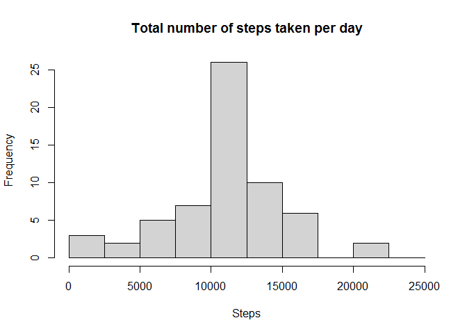

## Loading and preprocessing the data

```r
library(ggplot2)
data <- read.csv("./data/activity.csv")
str(data)
```

```
## 'data.frame':	17568 obs. of  3 variables:
##  $ steps   : int  NA NA NA NA NA NA NA NA NA NA ...
##  $ date    : chr  "2012-10-01" "2012-10-01" "2012-10-01" "2012-10-01" ...
##  $ interval: int  0 5 10 15 20 25 30 35 40 45 ...
```

```r
data$date <- as.Date(data$date)
summary(data)
```

```
##      steps             date               interval     
##  Min.   :  0.00   Min.   :2012-10-01   Min.   :   0.0  
##  1st Qu.:  0.00   1st Qu.:2012-10-16   1st Qu.: 588.8  
##  Median :  0.00   Median :2012-10-31   Median :1177.5  
##  Mean   : 37.38   Mean   :2012-10-31   Mean   :1177.5  
##  3rd Qu.: 12.00   3rd Qu.:2012-11-15   3rd Qu.:1766.2  
##  Max.   :806.00   Max.   :2012-11-30   Max.   :2355.0  
##  NA's   :2304
```


## What is mean total number of steps taken per day?
1. Calculate the total number of steps taken per day.  

```r
daily_steps <- aggregate(data$steps, list(data$date), sum, na.rm = TRUE)
names(daily_steps) <- c("Date", "Steps")
```
2. Histogram of the total number of steps taken each day .   

```r
with(daily_steps, hist(Steps, breaks = seq(0,25000, by=2500), main = "Total number of steps taken per day"))
```

<!-- -->
<br>
3. Calculate and report the mean and median of the total number of steps taken per day.  

```r
mean(daily_steps$Steps)
```

```
## [1] 9354.23
```

```r
median(daily_steps$Steps)
```

```
## [1] 10395
```


## What is the average daily activity pattern?
1. Make a time series plot of the 5-minute interval (x-axis) and the average number of steps taken, averaged across all days (y-axis).  

```r
avg_daily_steps <- aggregate(data$steps,list(data$interval), mean, na.rm=TRUE)
names(avg_daily_steps) <- c("Interval", "Steps")
with(avg_daily_steps, plot(Interval,Steps, type="l", ylab="Average number of steps"))
```

<!-- -->
<br>
2. Which 5-minute interval, on average across all the days in the dataset, contains the maximum number of steps?

```r
avg_daily_steps[which.max(avg_daily_steps$Steps),1]
```

```
## [1] 835
```


## Imputing missing values
1. Calculate and report the total number of missing values in the dataset 

```r
sum(is.na(data$steps))
```

```
## [1] 2304
```
2. Devise a strategy for filling in all of the missing values in the dataset.  
Ans. All the missing values are replaced by the mean for that 5-minute interval.
3. Create a new dataset that is equal to the original dataset but with the missing data filled in.

```r
data1 <- data
for(i in 1:nrow(data1)) {
      if(is.na(data1[i,1])) 
            data1[i,1] <- avg_daily_steps[which(data1[i,3]==avg_daily_steps[,1]),2]
}
```
4. Make a histogram of the total number of steps taken each day and Calculate and report the mean and median total number of steps taken per day.

```r
daily_steps_data1 <- aggregate(data1$steps,list(data1$date), sum, na.rm=TRUE)
names(daily_steps_data1) <- c("Date", "Steps")
with(daily_steps_data1, hist(Steps, breaks = seq(0,25000, by = 2500), main = "Total number of steps taken per day"))
```

<!-- -->

```r
mean(daily_steps_data1$Steps)
```

```
## [1] 10766.19
```

```r
median(daily_steps_data1$Steps)
```

```
## [1] 10766.19
```


## Are there differences in activity patterns between weekdays and weekends?
1. Create a new factor variable in the dataset with two levels – “weekday” and “weekend” indicating whether a given date is a weekday or weekend day.

```r
data1$day <- weekdays(data1$date)
for(i in 1:nrow(data1)) {
      if(data1[i,4] %in% c("Saturday","Sunday")) data1[i,4] <- "Weekend"
      else data1[i,4] <- "Weekday"
}
data1$day <- as.factor(data1$day)
```
2. Make a panel plot containing a time series plot of the 5-minute interval (x-axis) and the average number of steps taken.

```r
avg_daily_steps_data1 <- aggregate(data1$steps, list(data1$interval,data1$day), mean, na.rm=TRUE)
names(avg_daily_steps_data1) <- c("Interval", "Day", "Steps")
ggplot(avg_daily_steps_data1, aes(Interval,Steps, col=Day))+
      facet_grid(Day~.)+
      geom_line()+
      ylab("Average number of steps")
```

<!-- -->

